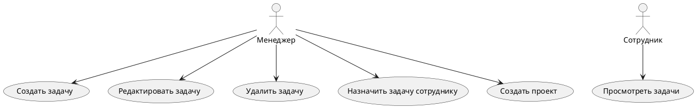
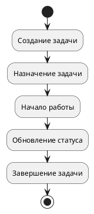
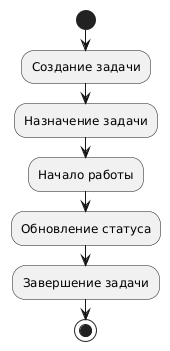

# 🖼 UML-диаграммы

Документ описывает диаграммы UML для приложения «Управление задачами и проектами».

---

## 1️⃣ Use Case Diagram

**Акторы:**  
- Менеджер  
- Сотрудник  

**Сценарии (Use Cases):**  
- Создать задачу  
- Редактировать задачу  
- Удалить задачу  
- Назначить задачу сотруднику  
- Просмотреть задачи  
- Создать проект  

**Код PlantUML для Use Case:**

---
# 🖼 Activity_Diagram-диаграммы

Документ описывает диаграммы Activity_Diagram для приложения «Управление задачами и проектами».

---

## 2️⃣ Activity Diagram

**Процесс «Полный цикл задачи»:**  
Создание → Назначение → Начало работы → Обновление статуса → Завершение

**Код PlantUML для Activity Diagram:**

